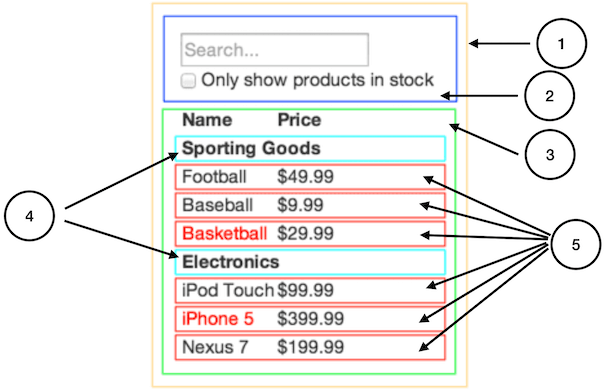

React és, en la nostra opinió, la millor forma de contruir grans i ràpides aplicacions web amb JavaScript. Ha escalat molt bé per a nosaltres a Facebook i Instagram.

Una de les parts més grans de React és com et fa pensar de les aplicacions mentres les construeixes. En aquest document, t'ensenyarem el procés de contruir una taula de productes amb una funcionalitat de cerca emprant React.

## Comença amb una maqueta {#start-with-a-mock}

Imagina que ja tenim una API JSON i una maqueta del nostre dissenyador. La maqueta té aquesta pinta:


La nostra JSON API retorna dades que són així:

```
[
  {category: "Sporting Goods", price: "$49.99", stocked: true, name: "Football"},
  {category: "Sporting Goods", price: "$9.99", stocked: true, name: "Baseball"},
  {category: "Sporting Goods", price: "$29.99", stocked: false, name: "Basketball"},
  {category: "Electronics", price: "$99.99", stocked: true, name: "iPod Touch"},
  {category: "Electronics", price: "$399.99", stocked: false, name: "iPhone 5"},
  {category: "Electronics", price: "$199.99", stocked: true, name: "Nexus 7"}
];
```

## Pas 1: Partir l'interfície d'usuari en una jerarquia de components {#step-1-break-the-ui-into-a-component-hierarchy}

La primera cosa que hauries de fer és dibuixar capces al voltant de cada component (i subcomponent) a la maqueta i donar-lis noms a tots. Si estàs treballant amb un equip de disseny, pot ser ja ha fet això, així que ves a comentar-ho! Les capes de Photoshop que hagin usat poden acabar sent els teus components de React!

Però com saps què hauria de ser el seu propi component? Usa la mateixa tècnica per decidir si hauries de crear una nova funció o objecte. Una tècnica és la del [principi de responsabilitat única](https://en.wikipedia.org/wiki/Single_responsibility_principle), que és, un component només hauria de fer idealment una sola cosa. Si acaba creixent, hauria de descomposar-se en components més petits.

Com que normalment mostres un model de dades JSON a l'usuari, veuràs que si el teu model ha estat construit de manera adequada, la teva interfície d'usuari (i llavors la teva estructura de components) encaixarà perfectament. Això passa perquè les interfícies d'usuari i els models de dades tendeixen a seguir la mateixa *arquitectura d'informació*. Separa la teva interfície d'usuari en components, on cada component representa una part del teu model de dades.



Veuràs aquí que tenim cinc components a la nostra aplicació. Hem escrit en itàlica les dades que cada component representa.

  1. **`FilterableProductTable` (taronja):** conté tot l'exemple
  2. **`SearchBar` (blau):** rep totes *les entrades de l'usuari*
  3. **`ProductTable` (verd):** mostra i filtra la *colecció de dades* basades en *les entrades de l'usuari*
  4. **`ProductCategoryRow` (turquesa):** mostra una capçalera per a cada *categoria*
  5. **`ProductRow` (vermell):** mostra una fila per cada *producte*

Si mires `ProductTable`, veuràs que la capçalera de la taula (contenint les etiquetes "Name" i "Price") no és el seu propi component. Això és qüestió de preferència, i hi ha una raons per fer-ho de distintes formes. Per a aquest exemple, l'hem deixat com a part de `ProductTable` perquè forma part de renderitzar la *colecció de dades* que és la responsabilitat de `ProductTable`. Malgrat això, si aquesta capçalera es torna complexa (per exemple, si volguéssim afegir una forma d'ordenar-la), tendria sentit que `ProductTableHeader` fos el seu propi component.

Ara que hem identificat els components a la maqueta, posem-los en jerarquia. Els components que apareixin a dins altres components a la maqueta haurien d'aparèixer com a fills a la jerarquia:

  * `FilterableProductTable`
    * `SearchBar`
    * `ProductTable`
      * `ProductCategoryRow`
      * `ProductRow`

## Pas 2: Contruir una versió estàtica amb React {#step-2-build-a-static-version-in-react}

<p data-height="600" data-theme-id="0" data-slug-hash="BwWzwm" data-default-tab="js" data-user="lacker" data-embed-version="2" class="codepen">Mira el Pen <a href="https://codepen.io/gaearon/pen/BwWzwm">Thinking In React: Step 2</a> a <a href="https://codepen.io">CodePen</a>.</p>
<script async src="https://production-assets.codepen.io/assets/embed/ei.js"></script>

Ara que tens la jerarquia de components, és el moment d'implementar la teva aplicació. La forma més fàcil és construir una versió que agafa el teu model de dades i renderitza la interfície d'usuari però no té cap interactivitat. És millor separar aquests processos perquè contruir una versió estàtica requereix molta escriptura i no pensar, i afegir interactivitat requereix molt de pensar i poca escriptura. Veurem per què.

Per construir una versió estàtica de la teva aplicació que renderitzi el teu model de dades, voldràs crear components que reusin altres components i passin dades usant *props*. *props* són una forma de passar dades de pares a fills. Si ets familiar amb el concepte d'*estat*, **no usis estat de cap manera** per construir aquesta versió estàtica. L'estat està reservat només per a la interactivitat, que és, dades que canvien al llarg del temps. Com que això és una versió estàtica de l'aplicació, no el necessites.

Pots construir de dalt a baix o de baix a dalt. És a dir, pots començar amb la construcció dels components més amunt en la jerarquia (per exemple començant amb `FilterableProductTable`) o amb els inferiors en ell (`ProductRow`). En exemples més senzills, en general és més fàcil anar de dalt a baix, i en projectes més grans, és més fàcil anar de baix a dalt i escriure proves a mesura que vas construint.

Al final d'aquest pas, tindràs una biblioteca de components reutilitzables que renderitzen el teu model de dades. Els components només tindran mètodes `render()` ja que es tracta d'una versió estàtica de l'aplicació. El component a la part superior de la jerarquia (`FilterableProductTable`) prendrà el teu model de dades com a prop. Si fas un canvi al model de dades subjacent i crides a `ReactDOM.render()`, s'actualitzarà la interfície d'usuari. Pots veure com està actualitzada la teva IU i on fer els canvis. **El flux de dades en un sentit** de React (també anomenat *one-way binding*) ho manté tot modular i ràpid.

Revisa la [documentació de React](/docs/) si necessites ajuda amb aquest pas.

### Una petita pausa: Props vs. estat {#a-brief-interlude-props-vs-state}

Hi ha dos tipus de dades "model" a React: props i estat. És important entendre la distinció entre les dues; dóna una ullada a [la documentació oficial de React](/docs/state-and-lifecycle.html) si no estàs segur de quina és la diferència. Mira també [Quina és la diferència entre l'estat i les props?](/docs/faq-state.html#what-is-the-difference-between-state-and-props)

## Pas 3: identifica la representació mínima (però completa) de l'estat de la IU {#step-3-identify-the-minimal-but-complete-representation-of-ui-state}

Per fer que la teva UI sigui interactiva, has de poder activar els canvis al model de dades subjacent. React aconsegueix això amb l'**estat**.

Per crear la teva aplicació correctament, primer has de pensar en la mínima quantitat d'estat mutable que necessita l'aplicació. La clau aquí és que [*no et repeteixis*](https://en.wikipedia.org/wiki/Don%27t_repeat_yourself) (DRY: Don't Repeat Yourself). Esbrina la mínima representació absoluta de l'estat que necessita la teva aplicació i calcula tot el que necessitis sota demanda. Per exemple, si estàs construint una llista de tasques, només mantingues un array de les tasques; no mantinguis una variable d'estat separada per al contador. En canvi, quan vulgues renderitzar el compte de tasques, agafa la llargada de l'array de tasques.

Pensa en totes les peces de dades en el nostre exemple d'aplicació. Disposem de:

  * La llista original de productes
  * El text de cerca que l'usuari ha introduït
  * El valor de la checkbox
  * La llista filtrada de productes

Anem a través de cada un i esbrinem quin és l'estat. Fes tres preguntes sobre cada peça de dades:

  1. És passat d'un pare a través de props? Si és així, probablement no és estat.
  2. Es manté inalterat en el temps? Si és així, probablement no és estat.
  3. Es pot calcular a partir d'un altre estat o props en el teu component? Si és així, no és estat.

La llista original de productes es transmet com a props, de manera que no és estat. El text de cerca i la checkbox sembla que siguin estat ja que canvien en el temps i no es poden computar de qualsevol cosa. I finalment, la llista filtrada de productes no és estat perquè es pot calcular combinant la llista original de productes amb el text de cerca i el valor de la checkbox.

Així que finalment, el nostre estat és:

  * El text de cerca que l'usuari ha introduït
  * El valor de la checkbox

## Pas 4: Identifica on ha de viure el teu estat {#step-4-identify-where-your-state-should-live}

<p data-height="600" data-theme-id="0" data-slug-hash="qPrNQZ" data-default-tab="js" data-user="lacker" data-embed-version="2" class="codepen">Mira el Pen <a href="https://codepen.io/gaearon/pen/qPrNQZ">Thinking In React: Step 4</a> a <a href="https://codepen.io">CodePen</a>.</p>

OK, així que hem identificat quin és el conjunt mínim d'estat de l'aplicació. A continuació, necessitem identificar quin component muta, o *posseeix*, aquest estat.

Recorda: React és tot sobre flux de dades d'un sentit a la jerarquia de components. Pot ser no sigui immediatament clar quin component hauria de posseir l'estat. **Això és sovint la part més difícil d'entendre per als nouvinguts,** així que segueix aquests passos per esbrinar-ho:

Per a cada peça d'estat en la teva aplicació:

  * Identifica cada component que renderitza alguna cosa basada en aquell estat.
  * Troba un component comú a aquests (un component per sobre de tots els components que necessiten l'estat en la jerarquia).
  * Aquest o un altre component més a dalt en la jerarquia haurien de posseir l'estat.
  * Si no pots trobar un component on tingui sentit posseir l'estat, crea un nou component únicament per tenir l'estat i afegeix-lo en algun lloc de la jerarquia per sobre dels component que el necessitin.

Anem a veure aquesta estratègia per a la nostra aplicació:

  * `ProductTable` necessita filtrar la llista de producte basat en l'estat i `SearchBar` necessita mostrar el text de cerca i l'estat de la checkbox.
  * El component pare comú és `FilterableProductTable`.
  * Conceptualment té sentit per al text de cerca i el valor de la checkbox que visquin a `FilterableProductTable`

Bé, així que hem decidit que el nostre estat viu a `FilterableProductTable`. En primer lloc, afegeix una propietat d'instància `this.state = {filterText: '', inStockOnly: false}` al `constructor` de `FilterableProductTable` per reflectir l'estat inicial de la teva aplicació. Llavors, passa `filterText` i `inStockOnly` a `ProductTable` i `SearchBar` com a prop. Finalment, utilitza aquestes props per filtrar les files a `ProductTable` i establir els valors dels camps de formulari a `SearchBar`.

Pots començar a veure com es comportarà la teva aplicació: posa `filterText` a `"ball"` i recarrega la teva aplicació. Veuràs que la taula de dades s'ha actualitzat correctament.

## Pas 5: Afegeix flux de dades invers {#step-5-add-inverse-data-flow}

<p data-height="600" data-theme-id="0" data-slug-hash="LzWZvb" data-default-tab="js,result" data-user="rohan10" data-embed-version="2" data-pen-title="Thinking In React: Step 5" class="codepen">Mira el Pen <a href="https://codepen.io/gaearon/pen/LzWZvb">Thinking In React: Step 5</a> a <a href="https://codepen.io">CodePen</a>.</p>

Fins ara, hem construït una aplicació que renderitza correctament com una funció de props i estat que flueix cap avall de la jerarquia. Ara és el moment de tractar les dades que flueixen de l'altra manera: els components de formulari profunds en la jerarquia necessiten actualitzar l'estat a `FilterableProductTable`.

React fa que aquest flux de dades explícit per ajudar a entendre com funciona el teu programa, però requereix una mica més d'escriptura que el tradicional flux en dos sentits.

Si intentes escriure o marques la checkbox en la versió actual de l'exemple, veuràs que React ignora la teva entrada. Això és intencional, com que hem fixat la prop `value` de l'`input` perquè sempre sigui igual a l'`estat` passat de `FilterableProductTable`.

Anem a pensar en el que volem que succeeixi. Volem assegurar-nos que cada vegada que l'usuari canviï el formulari, actualitzem l'estat per reflectir l'entrada de l'usuari. Ja que els components només haurien d'actualitzar el seu propi estat, `FilterableProductTable` passarà callbacks a `SearchBar` que es cridaran quan l'estat s'hagi d'actualitzar. Podem utilitzar l'esdeveniment `onChange` en les entrades per això. Les callbacks passades per `FilterableProductTable` cridaran `setState()`, i l'aplicació s'actualitzarà.

## I això és tot {#and-thats-it}

Tan de bo, això et doni una idea de com pensar construir components i aplicacions amb React. Tot i que pot ser una mica més d'escriptura del que estàs acostumat, recorda que el codi es llegeix molt més del que s'escriu, i és menys difícil de llegir aquest codi si és modular i explícit. A mesura que comencis a construir grans biblioteques de components, apreciaràs això, i amb la reutilització de codi, les línies de codi començaran a reduir-se. :)
